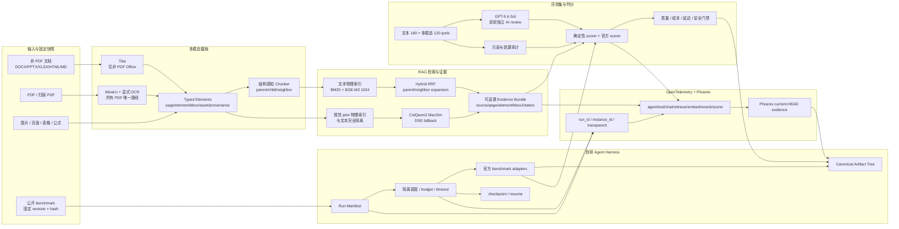
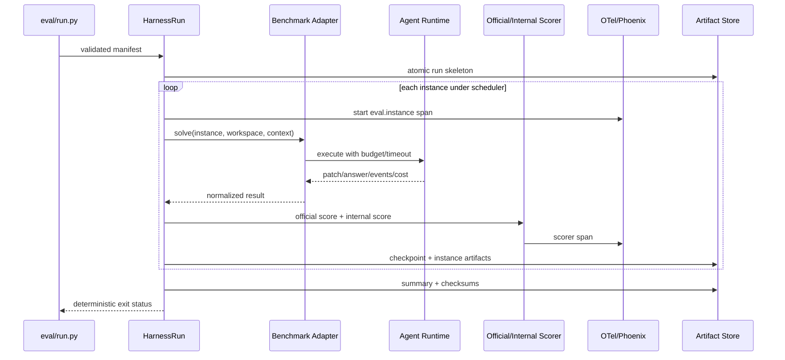
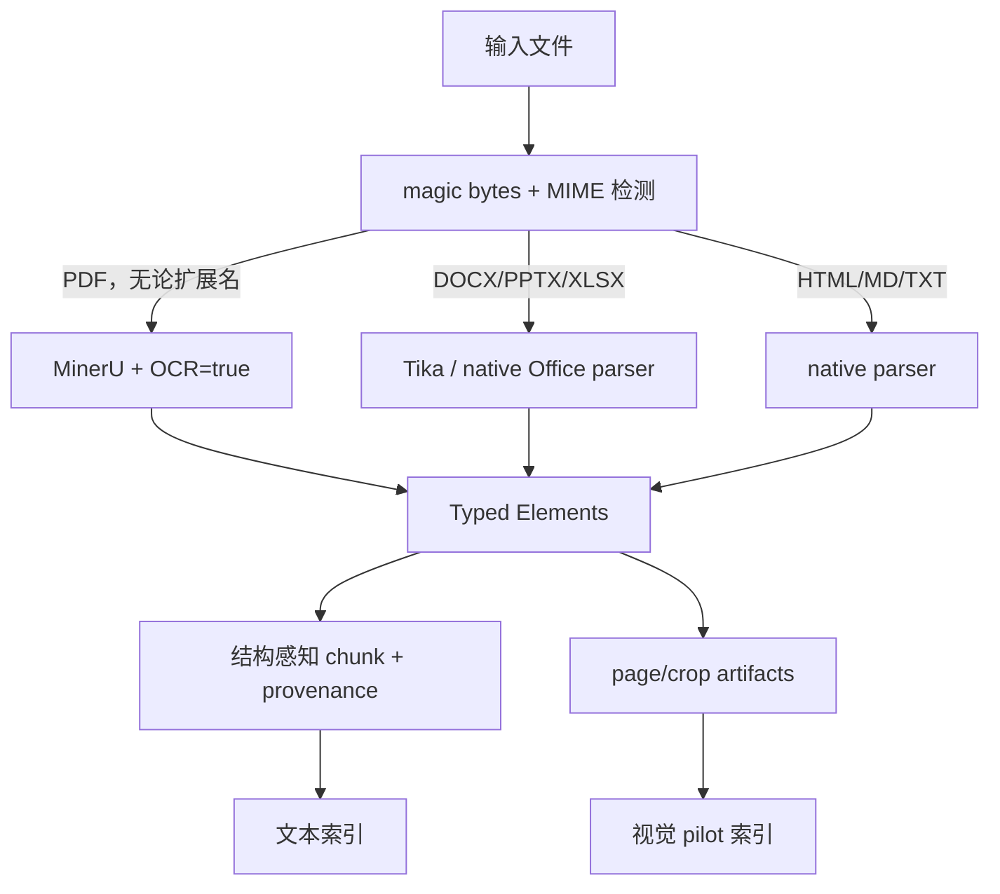
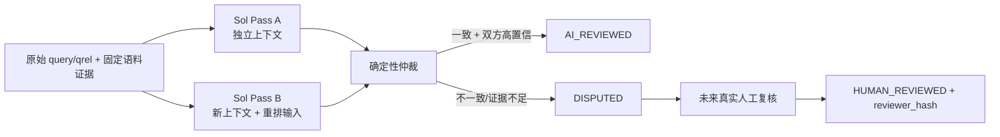

# 项目完整设计地图：Harness、多模态 RAG、评测集与可观测性

日期：2026-08-07  
仓库：`D:\vscode\localcode`  
执行分支：`feature/complete-design-implementation`  
基线 HEAD：`15738ebaaf99915b73dd504d7ef20b4748122cba`  
文档角色：**唯一权威执行地图（Single Source of Truth）**

> 后续所有 Agent 必须先读完本文，再选择任务。旧 handoff、progress、spec 和 plan 只作为历史证据或局部设计输入；当它们与本文冲突时，以本文和当前代码/运行时新鲜验证为准。任何 Agent 不得自行改写四条主线的依赖顺序、状态口径、数据边界和发布门禁。

## 1. 项目使命与完成定义

本项目要同时完成四个互相约束的目标：

1. **自研 Agent Harness**：统一驱动 Agent benchmark 和内部任务，提供隔离、预算、恢复、失败分类、canonical artifacts、官方 scorer adapter 和可复现实验。
2. **多模态 RAG**：统一文本、图片、表格、公式、版面和多页证据；PDF 全部由 MinerU + 显式 OCR 解析，Tika 只处理非 PDF Office；文本与视觉索引物理隔离。
3. **权威评测集**：文本和多模态 qrels、公开 benchmark、污染审计、确定性 scorer、GPT-5.6 Sol 双轮独立拟人工复核，以及未来真实人工复核接口。
4. **全链路可观测性**：从 Agent run 到 tool、orchestrator、retrieval、embedding、rerank、LLM、citation 和 scorer 的同 trace 关联，并在 Phoenix 中形成 current-HEAD 可复核证据。

四个目标不是四个独立功能。最终系统必须满足：

```text
同一 eval run
  -> 由 Harness 锁定代码、数据、模型、预算和环境
  -> 经多模态 RAG 产生可追溯证据
  -> 由版本化 qrels/official scorer 判分
  -> 在 Phoenix 中用 run_id + instance_id 还原完整执行链
  -> 产出不可歧义、可恢复、可复现、可审计的 artifact tree
```

只有以下全部成立，项目整体才能标为 `VERIFIED`：

- Harness 统一入口真实运行 SWE-bench Verified、Terminal-Bench、tau2-bench 的固定公开样本，并保留官方 scorer 输出。
- 文本 RAG 数据一致、scorer 数学正确、180 条 qrels 有可审计复核状态，新 BM25/BGE-M3/Hybrid 报告有效。
- 多模态 RAG 有真实 MinerU OCR 页图、120 条多模态 qrels、真实视觉模型与 ViDoRe/bbox bake-off；视觉 alias 只在门禁后启用。
- Phoenix 能从一个 `eval.run_id` 找到同一父链的 Agent、tool、chat、retrieve、embedding、rerank（启用时）和 scorer spans。
- 每个结论绑定 Git SHA、dirty hash、数据/模型 revision、index mapping、prompt hash、预算、环境、trace ID 和 artifact hash。

## 2. 统一状态语言

所有 Agent 只能使用以下状态，不写“基本完成”“差不多”“已支持”等模糊表述：

| 状态 | 定义 | 所需证据 |
|---|---|---|
| `DESIGNED` | 契约、架构、边界和验收已写清 | spec/design map |
| `IMPLEMENTED` | 生产代码或执行脚本存在 | code diff + focused tests |
| `VERIFIED` | 当前 HEAD 在目标环境完成真实验收 | 命令、exit code、artifact、runtime snapshot |
| `BLOCKED` | 缺依赖、数据、权限或前置门禁，无法真实验收 | blocker、已尝试动作、数据影响、唯一下一步 |

Mock、synthetic、contract test 只能证明局部 `IMPLEMENTED`，不能代替官方数据、真实模型、真实服务和显式集成测试。

## 3. 当前事实基线

### 3.1 Git 与工作区保护

```text
branch: feature/complete-design-implementation
HEAD:   15738ebaaf99915b73dd504d7ef20b4748122cba
remote: ahead 17
```

当前已有用户/WIP 变更：

```text
 M orchestrator/eval/runner.py
 M scripts/corpus/import_docs.py
?? _tmp_audit_analysis.json
?? data/reports/
```

约束：不得 `git reset --hard`、`git checkout --`、覆盖或顺手提交这些内容。每个 Agent 开始前必须重新运行 `git status --short --branch` 和逐文件 `git diff`，在现有修改上继续。

### 3.2 服务与模型

2026-08-07 新鲜检查：

| 服务 | 状态 | 证据摘要 |
|---|---|---|
| Go server `:8081` | 可用 | `/healthz`: `status=ok`, `embedding_preflight=ok` |
| 本机 embedding `:8009` | 可用 | `BAAI/bge-m3@5617a9f6...`, 1024 dims, ready |
| Phoenix `:6006` | 不可达 | 当前未运行 |

Docker Desktop 可按用户全局授权隐藏启动。授权不包含删除 container、volume、index、cache 或任何业务数据。

### 3.3 语料与索引

MySQL `knowledge_document`：ACTIVE 3012、SKIPPED 83、FAILED 0、STAGED 0，总计 3095。`document_vectors` 24859 行。

ES：

```text
knowledge_base             44 chunks
knowledge_base_v2_bge_m3   24778 chunks
v2 distinct document_id     2972
knowledge_base_current -> knowledge_base_v2_bge_m3
```

一致性审计 exit 1：

```text
consistent=false
mysqlActiveDocuments=3012
esUniqueDocumentIds=2972
orphanCount=0
missingCount=40
vectorGapCount=0
```

40 个缺失 ACTIVE 文档：git 1、go 9、postgresql 28、python 2。**alias 已切到不完整 v2** 是当前最高发布风险。

### 3.4 四目标现状矩阵

| 目标 | 当前级别 | 已有能力 | 主要缺口 |
|---|---|---|---|
| Harness | `IMPLEMENTED` 局部 | runner/budget/resume/artifacts/adapters | 未接统一入口；无 current-HEAD 官方 run |
| 多模态 RAG | `DESIGNED` + 脚手架 | visual index/artifact/encoder contracts | encoder 未实现；无真实 qrels/model/index/bake-off |
| 评测集 | `BLOCKED` | 180 queries/qrels；三路 predictions | 0/180 复核；schema 冲突；scorer `nDCG>1` |
| 可观测性 | `IMPLEMENTED` 局部 | root/tool/chat span；W3C traceparent | 无生产 RAG/scorer spans；Phoenix 未运行 |

## 4. 目标架构总图



### 4.1 统一控制面

Harness 是控制面，不是另一个 scorer。它负责：

- 锁定 run manifest；
- 创建实例 workspace；
- 施加 budget、timeout、并发和网络策略；
- 调用薄 benchmark adapter；
- 传播 run/instance trace context；
- 收集官方 scorer、内部 scorer 和 trace evidence；
- 原子写 canonical artifacts；
- checkpoint/resume 和 failure taxonomy。

RAG、评测和可观测性都通过稳定 contract 接入 Harness，不能各自另建一套 run lifecycle。

### 4.2 统一数据面

所有检索结果都必须回溯到稳定 provenance：

```text
corpus_generation
source_id / source_commit / source_path / source_sha256
document_id
section_path
page_id / page_index / page_ref
element_id / element_type
bbox / bbox_scaled
asset_ref / asset_sha256
parser / parser_version / OCR flags
embedding_model / model_revision / dimensions
physical_index / mapping_hash
```

文本 chunk、视觉 page/crop、qrels、prediction、citation 和 trace 使用同一组稳定 ID。volatile chunk ordinal 不能作为唯一 gold key。

## 5. 统一 Artifact 设计

每个真实 run 必须输出：

```text
eval_results/<run_id>/
  manifest.json
  environment.json
  instances.jsonl
  events.jsonl
  failures.jsonl
  summary.json
  predictions.jsonl
  scorer/
    official-output.*
    internal-report.json
  traces/
    trace-summary.json
    span-assertion.json
  artifacts/<instance_id>/...
  checksums.sha256
```

`manifest.json` 最少包含：

```text
run_id, benchmark, mode(official|synthetic), git_sha, dirty_hash
dataset_name, dataset_revision, dataset_hash
model, model_revision, prompt_hash
corpus_generation, qrels_hash
physical_index, index_mapping_hash
budgets, timeout, max_processes, network_policy
seed, start_time, runtime/container versions
```

规则：

- `synthetic=true` 必须位于 manifest 顶层，不能藏在 notes。
- 写入用临时文件 + atomic rename；resume 不覆盖已完成 instance。
- 所有 secret 先 redaction 后写 artifact。
- 失败也必须写 manifest、events、failure taxonomy 和退出码。

## 6. 目标一：自研 Agent Harness

### 6.1 当前实现审计

核心文件：

- `eval/harness/runner.py`
- `eval/harness/budget.py`
- `eval/harness/artifacts.py`
- `eval/adapter.py`
- `eval/run.py`

已有每实例 workspace、预算、checkpoint/resume、failure taxonomy、artifact tree、原子 summary、secrets redaction，以及 EvalPlus、SWE-bench、Terminal-Bench、tau2-bench、BEIR、MIRACL、BRIGHT、ViDoRe adapters。

GPT-5.6 Sol 只读复核确认的缺口：

1. `eval/run.py` 直接调用 adapter，未经过 `HarnessRun`。
2. `max_processes` 未实际使用；网络禁用只有标记；预算在任务完成后才检查。
3. `ERROR_SCORER` 无可达路径；缺 `instance_id` 被静默跳过。
4. `eval_results/` 不存在，统一 artifact contract 没有真实产物。
5. SWE-bench 脚本与 adapter prediction 文件名不一致；模块 CLI 使用 `_StubAdapter`；真实加载失败会降级 synthetic。
6. Terminal-Bench/tau2-bench 只通过 mocked subprocess，官方包、数据 pin 和真实分数缺失。

状态：`DESIGNED=yes / IMPLEMENTED=standalone core / VERIFIED=no / BLOCKED=integration+official runs`。

### 6.2 Harness 生命周期



### 6.3 实现任务与 TDD 门禁

#### H1：统一入口

修改 `eval/run.py`、Harness runner/artifacts/budget 和 adapter context。先用 deterministic fake adapter 写显式集成测试：3 个实例运行后必须存在完整 artifact tree，且调用链经过 HarnessRun。

#### H2：执行约束

测试并实现：pre-start 和 runtime budget、真实 `max_processes`、timeout/cancel、明确 network policy、缺 instance_id fail closed、scorer exception -> `ERROR_SCORER`。

#### H3：adapter 真实性

- SWE-bench：统一 prediction 路径；真实 CLI 不用 `_StubAdapter`；数据失败不自动 synthetic。
- Terminal-Bench/tau2-bench：核对官方模块/CLI、透传 output_dir、固定 package/data/container revision。
- 所有 synthetic run 必须显式 opt-in。

#### H4：官方小样本

按 1 个实例 -> 固定 10 个实例执行 SWE-bench Verified、Terminal-Bench、tau2-bench。每阶段用官方 scorer，扩大运行需要新的检查点。

### 6.4 Harness 验收

- `eval/run.py -> HarnessRun -> adapter -> scorer` 显式集成测试通过。
- 中断/resume 不重跑完成实例，artifact hash 稳定。
- 预算、timeout、并发、失败分类可由测试触达。
- 三个官方 benchmark 各有固定真实小样本产物。
- 每个 instance 有 run_id、instance_id 和 trace_id join。

## 7. 目标二：多模态 RAG

### 7.1 强制输入路由



不可违反：PDF 不得请求 Tika。伪装成非 PDF 扩展名的 PDF 仍由 magic bytes 检测并进入 MinerU OCR。

### 7.2 Chunk 策略

Chunker 面向多模态元素而非纯字符切割：

- 同章节短文本可合并；超长正文按 token overlap 切分。
- code 保持完整行和语义块。
- table、equation、image 为硬边界，不与无关正文拼接。
- caption 与对象建立显式关联，并进入 contextual embedding。
- parent/child/previous/next 关系持久化，检索时可做 evidence expansion。
- page/element/bbox/asset/parser provenance 贯穿存储、检索和 citation。

### 7.3 文本检索链

文本链目标：BM25 + BGE-M3 1024 维召回 -> RRF -> ACL-safe parent/neighbor expansion -> 可选 reranker -> Evidence Bundle。当前 alias 指向 v2，但数据缺 40 个文档，必须先修一致性。

### 7.4 视觉链

现有 `pkg/es/visual_index.go`、`orchestrator/rag/visual/artifacts.py` 和 `encoder.py` 只是脚手架；encoder 方法仍 `NotImplementedError`，无真实索引和 alias。

候选固定为：

```text
primary:  vidore/colqwen2-v1.0-merged
revision: 2c9a09bb37ed19b63eb94ae6c29bb4e76eb6e3c2

fallback: MrLight/dse-qwen2-2b-mrl-v1
revision: 3fde4464ea72da2a863ed8fa51f0f1b8045f0426
```

本机 RTX 4060 Laptop 8GB。BGE-M3 和视觉模型不得同时常驻 GPU；视觉编码使用独占离线窗口，batch=1 起步，记录 peak VRAM 和 OOM。

视觉物理索引命名：

```text
knowledge_page_visual_pilot_<model>_<revision8>_<date>
```

生产 alias：`knowledge_page_visual_current`，默认不存在。视觉和文本索引、mapping、alias、写入路径完全隔离。

### 7.5 视觉 pilot 数据与评测

1. 用真实 MinerU OCR 产物建立 500-1000 页集，覆盖 text/image/table/equation/layout/multi-page/中文跨语言。
2. 构建至少 120 条多模态 qrels，指向 document/section/page/element/bbox。
3. 跑 text baseline、ColQwen2 pooled、text+visual MaxSim、visual recall+MaxSim、DSE fallback。
4. 用 ViDoRe official scorer、自建 nDCG/Recall/MRR、bbox hit、P50/P95、GPU peak 做 bake-off。

### 7.6 多模态门禁

- 两次独立 run 相对 text baseline 同向提升。
- image/table subset Recall@5 不下降。
- bbox hit >= 0.85。
- 无 OOM；延迟和 GPU peak 在批准预算。
- model revision、dimensions、artifact hash fail closed。
- 以上全部通过前，不创建或切换 `knowledge_page_visual_current`。

## 8. 目标三：评测集与 Scorer

### 8.1 当前文本集问题

`qrels.text.jsonl` 与 `queries.text.jsonl` 各 180 行，六源各 30，中文 90。但：

- 0/180 有真实或 AI 复核状态；`reviewer_hash` 全空。
- 19 个 `section_path=[]` 与当前 schema `minItems:1` 冲突。
- 17 个 relevance=0 query 没有正 gold。
- `kb-q021`、`kb-q023` 中文 query 错标 `language=en`。
- 不得称为真人黄金集。

### 8.2 当前检索报告失效

| run | Recall@5 | MRR@10 | nDCG@10 |
|---|---:|---:|---:|
| BM25 | 0.5389 | 0.4066 | 1.0727 |
| BGE-M3 | 0.6722 | 0.5385 | 1.3104 |
| Hybrid RRF | 0.6056 | 0.4028 | 0.9034 |

nDCG 大于 1 证明 scorer 不正确。原因包括 relevance=0 未过滤、同一 document 多 chunk 重复贡献，以及当前 WIP 的 document-level matching 尚未完整去重。

旧 artifact 保留但必须标 `INVALIDATED`；不得删除或继续用作质量门禁。

### 8.3 Scorer 正确性契约

必须 TDD 覆盖：

1. 只把 `relevance > 0` 作为 relevant/IDCG。
2. qrels 按 eval unit 去重并取最大 relevance。
3. ranked hits 按同一 eval unit 保序去重。
4. Recall/MRR/DCG 使用去重序列。
5. `document` 与 `document+section` 是显式配置并写入 report。
6. negative/no-answer query 单独评分，不混入普通 retrieval macro。
7. 所有 query/group/overall 的 nDCG 为 finite 且在 `[0,1]`；超界 fail closed。

当前 `orchestrator/eval/runner.py` 是用户 WIP，必须保留其 document-level 方向并用上述测试决定最小修复。

### 8.4 GPT-5.6 Sol 拟人工复核

正式名称：**GPT-5.6 Sol 双轮独立拟人工复核集**。不得称真人双审。



每个 pass 判断 query 可回答性、语言、query type、document/section relevance、证据、污染风险和 confidence。Pass B 不读取 A 输出。

输出旁路文件，不直接覆盖原 qrels：

```text
data/eval/techdocs/qrels.sol-review-pass-a.jsonl
data/eval/techdocs/qrels.sol-review-pass-b.jsonl
data/eval/techdocs/qrels.sol-review.jsonl
results/eval/techdocs/sol-review-summary.json
```

字段：

```text
review_status: UNREVIEWED | AI_REVIEWED | DISPUTED | HUMAN_REVIEWED
reviewer_model, reviewer_revision, review_prompt_hash
review_pass, review_confidence, review_evidence, review_timestamp
```

Sol 永不生成 `reviewer_hash`。API key 只从环境变量读取，不进 prompt artifact、日志、trace 或 Git。复核必须引用固定语料证据，不能只凭模型常识。

### 8.5 评测层级

| 层级 | 数据 | 指标/Scorer | 用途 |
|---|---|---|---|
| Parser | MinerU OCR fixtures + 真实 PDF | element/page/bbox/provenance accuracy | 输入正确性 |
| Text retrieval | 180 qrels candidate | Recall/MRR/nDCG + source/language/type | 文本检索门禁 |
| Multimodal retrieval | 120 qrels + ViDoRe | nDCG/Recall/bbox hit | 视觉门禁 |
| Answer/citation | evidence-grounded set | faithfulness/citation precision/recall | RAG 回答质量 |
| Agent | SWE/Terminal/tau2 | official scorer | Harness 能力 |
| System | 全链真实 run | success/cost/P95/error taxonomy | 工业运行门禁 |

### 8.6 污染防线

- benchmark snapshot 与生产 corpus 分离，固定 revision/hash/license。
- qrels 不写入任何检索索引。
- 在评测前运行 contamination scanner；输出 lexical/normalized/near-duplicate/semantic 层结果。
- 发现泄漏时隔离 query/instance，不能仅在报告里备注后继续计分。

## 9. 目标四：可观测性

### 9.1 当前实现与缺口

已实现 Go `invoke_agent` root span、`execute_tool` span、Python sync/stream `chat` span，以及 Go -> Python W3C `traceparent`。

未实现：

- 生产 `rag.retrieve`、embedding、rerank、scorer spans。
- eval run/instance 属性与真实 OTel context 的关联。
- Phoenix 当前运行和 current-HEAD artifact。
- `trace_assert.py` 与实际 Phoenix project API/`context.trace_id` 结构的一致性。

`eval/adapter.py` 当前的 trace_id 只是 UUID，不等于 OTel trace。

### 9.2 目标 Span 树

```text
eval.run                         attributes: run_id, benchmark, git_sha
  eval.instance                  attributes: instance_id, dataset_revision
    invoke_agent                 Go root
      execute_tool               tool name/status/duration
      orchestrator               Python recovered W3C parent
        chat                     model/revision/tokens/cost
        rag.retrieve             mode/index/corpus_generation/top_k
          embedding              model/revision/dimensions/cache
          bm25 / vector
          fusion                 rrf_k/candidate_count
          rerank                 model/revision/input_count
          evidence.expand        parent/neighbor counts
    scorer                       scorer/version/result/failure
```

统一 join attributes：

```text
eval.run_id
eval.instance_id
git.commit
rag.query_hash
rag.corpus_generation
rag.index_name
rag.retrieval_mode
```

不记录原始 API key、internal token、DSN、完整敏感 query、完整 prompt 或隐私文档正文。

### 9.3 Phoenix 显式集成测试

1. 固定 Phoenix image version/digest，启动 4317/4318/6006。
2. 运行真实 Go -> Python -> retrieval -> LLM/DeepSeek -> scorer 路径。
3. 从实际 Phoenix API 按 project/run_id 查询 spans，处理分页和 `context.trace_id`。
4. 断言 span 类型、父链、run/instance join、11 个 `rag.*` schema 键、错误/成本字段。
5. 持久化 HEAD、dirty hash、镜像 digest、runtime、命令、exit code、run_id、trace_id、span 摘要和时间范围。

OTel exporter 关闭时业务路径必须正常退化。不得为让断言通过而只在测试里手工创建生产缺失 spans。

### 9.4 可观测性验收

- Phoenix current-HEAD 可达。
- 同一个 run_id 只关联期望 trace；instance 可一一定位。
- retrieve/embed/rerank/scorer 是真实生产调用点 spans。
- trace assertion 使用实际 Phoenix API，不依赖错误 mock schema。
- 故障 run 同样保留 span status、failure taxonomy 和 artifact。

## 10. 跨目标依赖路线图

任何 Agent 都必须从最早未完成阶段选择工作，不能越过前置门禁。

### Phase 0：基线与保护边界

重新记录 Git、dirty、服务、模型、alias、MySQL/ES、Phoenix；审查两个 WIP diff。输出脱敏 baseline artifact。

**通过条件：** snapshot 与实际一致，用户 WIP 未被覆盖。

### Phase 1：数据一致性 P0

先为 importer `--mysql-fast-poll` 写测试，移除硬编码凭据风险；用 `--source` + `--file` 幂等补齐 40 个文档。

核验命令：

```powershell
C:\Python312\python.exe scripts\corpus\consistency_audit.py `
  --generation techdocs-2026-07-30-v1 --list-limit 0
```

**通过条件：** exit 0，orphan/missing/vectorGap 均为 0；未切 alias，未删数据。

### Phase 2：Scorer 与 qrels 正确性 P0

TDD 修 relevance 过滤和逻辑 hit 去重；决定 document/section eval unit；修 schema、语言标签和 negative set；给旧 report 写 INVALIDATED 标记。

Focused：

```powershell
C:\Python312\python.exe -m pytest -q `
  tests\test_eval_runner.py `
  tests\eval\test_retrieval_metrics.py
```

**通过条件：** 所有 nDCG 边界测试通过，旧报告不再作为门禁。

### Phase 3：Sol 复核与新文本评测 P1

实现 strict-schema、resume、redaction 的 Sol reviewer；完成 A/B 两轮与确定性仲裁；用 candidate qrels 重跑三路 retrieval。

**通过条件：** 180 覆盖；AI_REVIEWED/DISPUTED 明确；新报告 nDCG 全部在 [0,1]，记录 qrels/index/mapping/scorer hashes。

### Phase 4：Harness 统一入口 P1

把 `eval/run.py` 接到 HarnessRun；完成 canonical artifacts、budget、并发、resume、failure taxonomy；修三类 Agent adapters。

**通过条件：** deterministic 显式集成测试与 1-instance Harness smoke 通过。

### Phase 5：生产 spans 与 Phoenix P1

在真实 retrieval/embedding/rerank/scorer 调用点加 spans；贯通 run/instance context；修 Phoenix assertion；跑 current-HEAD E2E。

**通过条件：** Phoenix artifact 可从 run_id 还原完整父链。

### Phase 6：官方 Agent benchmark P2

按 1 -> 固定 10 执行 SWE-bench Verified、Terminal-Bench、tau2-bench。

**通过条件：** official scorer + canonical artifact + trace join 齐全；synthetic 不混入。

### Phase 7：多模态视觉 pilot P2

建立真实 MinerU OCR 页图、120 qrels、ColQwen2/DSE 编码和独立 visual index，运行 ViDoRe/bbox bake-off。

**通过条件：** 视觉质量、bbox、显存、延迟、revision 门禁全部通过；此后才能单独评审 visual alias。

## 11. 每阶段执行协议

### 11.1 开始前

```powershell
cd D:\vscode\localcode
git status --short --branch
git rev-parse HEAD
git diff --check
git diff -- orchestrator/eval/runner.py
git diff -- scripts/corpus/import_docs.py
```

先使用 superpowers：`using-superpowers`；执行既定阶段用 `executing-plans`；实现或修 bug 用 `test-driven-development`；遇到失败用 `systematic-debugging`；声明完成前用 `verification-before-completion`。

### 11.2 开发中

1. 写失败测试并记录真实失败原因。
2. 做最小实现。
3. 跑 focused tests。
4. 跑与 blast radius 匹配的 regression。
5. 写 artifact 和状态更新。
6. 同步 Obsidian 本设计地图的“执行记录”附录，或对应 progress 文档。

### 11.3 提交前

```powershell
go test ./... -count=1
C:\Python312\python.exe -m pytest -q
git diff --check
git diff --cached --name-only
git diff --cached
```

显式集成测试必须另列命令和 exit code。只 stage 本阶段明确文件。阶段提交后推送到 `feature/complete-design-implementation`；网络失败时保留本地 commit 并报告，不重写历史。

### 11.4 阻塞报告

```text
Status: BLOCKED | IMPLEMENTED | VERIFIED
Phase/Task: <编号>
Evidence: <命令、exit code、artifact>
Blocker: <具体错误与已尝试动作>
Data changed: <对象；无则 none>
Rollback boundary: <恢复方式>
Next action: <唯一下一步>
```

## 12. 安全与回滚边界

1. 不删除 Docker container/volume、ES index、MySQL 行、MinIO 对象、模型 cache、staging、备份或历史 artifact。
2. 不覆盖 dirty worktree，不把无关变更混入 stage/commit。
3. API key、token、DSN 密码不进入代码、配置、日志、trace、测试 fixture、文档或 commit。
4. PDF 只走 MinerU OCR；Tika 只给非 PDF Office。
5. 文本数据一致性和有效 scorer 未通过前，不再次切换 `knowledge_base_current`。
6. 视觉全部门禁未通过前，不创建/切换 `knowledge_page_visual_current`。
7. 任何 alias 操作前后都记录实际目标，并准备单次原子反向操作；稳定观察前保留旧物理索引。
8. synthetic/mock 不能冒充 official；AI review 不能冒充 human review。

## 13. Agent 任务选择规则

多个 Agent 可以并行做**无共享状态**的只读审计、测试设计和独立 adapter 研究，但以下任务必须串行：

- importer WIP 与 40 文档修复；
- `orchestrator/eval/runner.py` scorer 收口；
- qrels merge；
- `eval/run.py`/Harness 统一入口；
- production tracing context plumbing；
- 任何索引、alias、数据库或真实 benchmark 执行。

每个 Agent 只能领取一个边界清楚的任务卡，必须返回：修改文件、测试命令/结果、artifact、状态、剩余 blocker、是否触碰数据。主 Agent 负责规格审查、质量审查、合并和 Obsidian 同步。

## 14. 当前最高优先级任务卡

### Task Card A：数据一致性

```text
Owner scope: scripts/corpus/import_docs.py + importer tests + targeted repair
Precondition: protect current WIP; services healthy
Deliverable: 40 repair reports + consistency audit exit 0
Forbidden: direct lifecycle edits, deletes, alias switch
```

### Task Card B：Scorer 正确性

```text
Owner scope: orchestrator/eval/runner.py + metrics tests
Precondition: inspect current WIP
Deliverable: dedupe/positive-only tests, finite nDCG <= 1, old reports invalidated
Forbidden: overwrite qrels or regenerate quality claims before tests pass
```

### Task Card C：Sol Reviewer

```text
Owner scope: eval/review + review schema/tests/artifacts
Precondition: scorer/qrels semantics frozen
Deliverable: Pass A, Pass B, deterministic merge, summary
Forbidden: reviewer_hash, human-review wording, secrets in artifacts
```

### Task Card D：Harness 集成

```text
Owner scope: eval/run.py + eval/harness + adapters + integration tests
Precondition: preserve official scorer contracts
Deliverable: canonical artifact tree and resumable 1-instance smoke
Forbidden: silent synthetic fallback
```

### Task Card E：Production Trace

```text
Owner scope: real RAG/scorer call sites + trace context + Phoenix assertion
Precondition: Harness run/instance contract frozen
Deliverable: current-HEAD Phoenix E2E artifact
Forbidden: test-only fake production spans or sensitive payload capture
```

### Task Card F：Visual Pilot

```text
Owner scope: MinerU page/crop dataset + 120 qrels + encoder + isolated visual index
Precondition: Phase 1-5 gates pass; exclusive GPU window
Deliverable: ViDoRe/bbox/latency/VRAM bake-off
Forbidden: Tika for PDF, shared text index, visual alias before gates
```

## 15. 执行记录模板

后续 Agent 在本文镜像旁的 progress 文件中按以下格式追加，不重写历史：

```markdown
## <timestamp> Phase <n> / Task <id>

- HEAD before:
- Dirty files protected:
- Changes:
- Tests and exit codes:
- Runtime/integration evidence:
- Artifacts:
- Data/index/alias impact:
- Status: DESIGNED | IMPLEMENTED | VERIFIED | BLOCKED
- Remaining blocker:
- HEAD after / commit / push:
```

## 16. 下一窗口启动指令

下一窗口收到任务后必须：

1. 先完整读取本文。
2. 使用 superpowers 技能体系。
3. 重新验证 Git/服务/数据，不把本文的易漂移快照当当前事实。
4. 保护 dirty worktree。
5. 从最早未通过 Phase 开始，默认是 Phase 1 数据一致性与 Phase 2 scorer 正确性。
6. GPT-5.6 Sol 只用于明确标识的 AI review、评估和拟人工复核，不伪装真人。
7. 每个阶段完成后同步 Obsidian、提交并推送当前 feature 分支；只 stage 本阶段文件。

## 17. 参考实现与历史文档

局部设计输入：

- `docs/superpowers/specs/2026-08-04-visual-chain-pilot-design.md`
- `docs/HANDOFF-2026-08-02-MULTIMODAL-RAG-AGENT-PLATFORM.md`
- `docs/HANDOFF-2026-08-02-REAL-CORPUS-IMPORT.md`
- `docs/observability-phoenix-live-trace-runbook.md`
- `docs/agent-eval-trace-plan.md`
- `docs/qrels/BUILD-180-QRELS.md`
- `docs/qrels/RUN-RETRIEVAL-EVAL.md`

它们用于追溯历史设计和命令，但本文是四目标共同执行地图。若局部文档写着“已验证”，仍需按本文要求在 current HEAD 重新运行并生成 artifact。

## 18. 2026-08-07 当前验证记录

本设计地图完成后，在包含既有 `runner.py` / `import_docs.py` WIP 的工作区运行：

```text
go test ./... -count=1
exit 0, all packages passed

C:\Python312\python.exe -m pytest -q
exit 0, 367 passed in 73.75s

C:\Python312\python.exe -m pytest -q \
  tests/test_eval_runner.py \
  tests/eval/test_retrieval_metrics.py \
  tests/eval/test_harness_resume.py \
  tests/eval/test_run_contract.py \
  tests/test_trace_schema.py \
  tests/eval/test_trace_assert.py \
  tests/test_visual_artifacts.py \
  tests/eval/test_vidore.py
exit 0, 64 passed in 7.41s

git diff --check
exit 0; only existing LF -> CRLF warnings on dirty Python files
```

Python 两组测试均出现 `requests` 依赖版本 warning：`urllib3 2.6.3` 与 `chardet 7.4.3` / `charset_normalizer 3.4.4` 不在当前 requests 声明的支持组合。它不是本轮失败，但后续环境固化任务应记录并解决版本 pin 漂移。

以上证据只说明当前单元/契约回归通过。它不验证 40 文档一致性、scorer 数学正确性、官方 Agent benchmark、Phoenix current-HEAD E2E 或真实视觉链。

## 19. 发给下一窗口的统一提示词

```text
继续执行 D:\vscode\localcode 项目。你必须先完整读取：
D:\vscode\localcode\docs\DESIGN-MAP-2026-08-07-HARNESS-MULTIMODAL-RAG-EVAL-OBSERVABILITY.md

该文件是自研 Agent Harness、多模态 RAG、权威评测集、全链路可观测性四个目标的唯一权威执行地图。所有设计、实现、测试、任务拆分、状态判断、提交和交接必须遵守其中的统一架构、Phase 依赖、artifact/ID/trace 契约、任务卡、门禁和回滚边界。不要另建冲突方案，不要跳过前置 Phase。

使用 superpowers：先 using-superpowers；执行地图用 executing-plans；功能/修复用 test-driven-development；故障用 systematic-debugging；完成前用 verification-before-completion。若使用子 Agent，只分派设计地图允许并行且无共享写状态的独立任务，主 Agent 负责规格审查、质量审查和合并。

开始时必须重新检查：git status、HEAD、当前 dirty diff、服务健康、Docker、MySQL/ES 数量、alias、embedding revision、Phoenix。保护现有用户/WIP：orchestrator/eval/runner.py、scripts/corpus/import_docs.py、_tmp_audit_analysis.json、data/reports/；不得 reset、checkout 或覆盖。

从设计地图中最早未通过的 Phase 开始：优先 Phase 1 数据一致性和 Phase 2 scorer/qrels 正确性。当前已知风险是 knowledge_base_current 已指向 v2，但 MySQL ACTIVE 3012、ES unique document_id 2972，缺 40；现有 BM25/BGE-M3 report 的 nDCG>1，无效。先用 TDD 收口 importer WIP 和 scorer WIP，再生成真实 artifact。任何 alias 变更前必须重新过门禁；不得删除旧索引或数据。

黄金集使用 GPT-5.6 Sol 做两个独立 pass 的拟人工复核和评估，输出 AI_REVIEWED/DISPUTED，记录 model/revision/prompt hash/evidence/confidence。不得生成真人 reviewer_hash，不得把 AI 复核称为真人复核。API key 只从环境变量或用户指定的仓库外私密文件读取，不打印、不落库、不写日志/trace/仓库。

所有 PDF 入口统一 MinerU + 显式 OCR；Tika 只处理 DOCX/PPTX/XLSX 等非 PDF。文本和视觉索引物理隔离；120 多模态 qrels、ViDoRe/bbox/显存/延迟门禁通过前，不创建或切换 visual alias。BGE-M3 和视觉模型在 RTX 4060 Laptop 8GB 上不得同时常驻 GPU。

严格使用 DESIGNED / IMPLEMENTED / VERIFIED / BLOCKED。Mock、synthetic、单元测试不能冒充真实官方 benchmark、真实模型或 current-HEAD E2E。每阶段都要：先失败测试 -> 最小实现 -> focused test -> regression/integration -> artifact -> 更新仓库和 D:\Obsidian\code-autogrowth\私人\localcode 的中文进展 -> 只 stage 本阶段文件 -> commit -> push 到 feature/complete-design-implementation。

禁止删除 Docker container/volume、ES index、MySQL 行、MinIO 对象、模型 cache、staging、备份或历史 artifact。Docker Desktop 需要时可隐藏启动，但不授权破坏性清理。

本窗口先返回：1) 新鲜基线；2) 选择的 Phase/Task Card；3) 失败测试；然后持续执行到该阶段真实验收或形成证据充分的 BLOCKED，不要只给计划。
```
