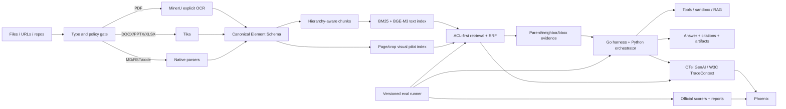

# 多模态 RAG、可观测性与自研 Agent Harness 顶层设计

状态：`DESIGNED`

日期：2026-08-02
设计目标：建立可生产演进、可追溯、可权威评测、可复现实验的本地优先 Agent 平台。

## 1. 设计选择

### 1.1 候选方案

**方案 A：单索引、统一多模态 embedding。** 实现快，但文本和视觉维度、生命周期、召回语义、许可证和硬件需求耦合；任何视觉模型变更都要重建主索引。拒绝。

**方案 B：文本主链 + 独立视觉 pilot + 晚融合。** 文本使用 BM25/BGE-M3，视觉 page/crop 使用独立物理 index，按 page/document 关系做 RRF/late interaction；视觉不可用时文本主链完整工作。推荐。

**方案 C：完全 page image late-interaction。** 对扫描件和复杂版面强，但存储、GPU、延迟、许可证和中文跨语言验证成本高，不适合作为第一生产路径。保留为研究轨。

最终采用方案 B。

## 2. 系统边界

平台分为控制面、数据面、执行面、观测面、评测面：



## 3. 规范化文档模型

### 3.1 Document

必须包含 `document_id/source_id/source_uri/source_sha256/mime/parser_name/parser_version/parser_backend/license_id/corpus_generation/ingested_at`。租户与权限字段只由 Go 控制面写入。

### 3.2 Element

必须包含：

- 身份与层级：`element_id/parent_id/reading_order/type/sub_type/heading_path`。
- 页面证据：`page_index/page_id/bbox/bbox_coordinate_system/rendered_page_ref`。
- 内容：`text/html/latex/code_language/caption/footnote`。
- 关系：`caption_of/footnote_of/continuation_of`。
- 资产：`asset_ref/asset_sha256/media_type`。
- provenance：`source_payload_ref/parser_name/parser_version/backend/source_sha256`。

所有 PDF 由 MinerU explicit OCR 产生这些字段。后处理工具只能消费 Element Schema，不得重新读取原 PDF。

### 3.3 Chunk

`text` 是展示/引用的原文，`embedding_text` 是标题路径、caption 和必要上下文的序列化。每个 chunk 保留 `document_id/page_id/page_span/parent_chunk_id/element_ids/element_types/bbox_refs/asset_refs/token_count/tokenizer_id/parser/corpus_generation/model_version/target_index`。

规则：普通 child 256–512 tokens；parent 1,000–2,000 tokens；只在同 heading path 合并；表格、代码、公式、图像为硬边界；overlap 只用于拆分单个超长元素。

## 4. 索引架构

### 4.1 文本索引

- 物理索引：`knowledge_base_v2_bge_m3_<mapping_version>_<date>`。
- 读取 alias：`knowledge_base_current`。
- `text_content/embedding_text` 为 text；`vector` 为 1024-d cosine；provenance/ACL 字段为 keyword/long/boolean。
- 每条文档写入 `model_version=BAAI/bge-m3@<commit-or-revision>`。
- 写入前校验 vector length、finite values、mapping dims、model revision、generation 和 target index。

### 4.2 视觉索引

- 物理索引：`knowledge_page_visual_pilot_<model>_<revision>_<date>`。
- 生产 alias：`knowledge_page_visual_current`，默认不存在。
- page image 与 crop asset 分开记录，必须引用 `page_id/element_id/bbox/asset_ref`。
- 首选以 ViDoRe/ColPali 系列做离线 bake-off；late-interaction 只对 text top 20–50 页面重排，不能把 patch 多向量塞进 BGE-M3 字段。

### 4.3 检索流程

1. 在 ES query filter 内先执行 `user_id/is_public/org_tag` ACL。
2. BM25 和 BGE-M3 各召回 top 100。
3. 视觉门槛通过时召回 page top 50；否则返回明确 `visual_path=disabled`。
4. 使用 RRF k=60；按 page/parent 做 diversity，不让同页 child 占满候选。
5. 可选 BGE reranker 对 text top 100 排序；视觉 late-interaction 对 page top 20–50 排序。
6. evidence expansion 加载命中 child 的 parent、必要前后邻块、精确 element、bbox 和资产。
7. 上下文打包器按 token budget 去重，保留 citation key；生成器不能看到无 provenance 的文本。

## 5. 多模态输入与输出

输入支持文本、代码、图片、PDF、Office 文档。图片二进制通过 protobuf content block 传递，不经 50KB 文本截断。PDF 返回 Markdown、typed elements、page renders 和 image assets；模型消息使用 OpenAI `image_url` 或 Anthropic image block。

答案 citation 最小单位为 `source_uri + page + element_id`，可选 bbox。UI/CLI 即使不能渲染 bbox，也必须输出稳定 citation ID，供 Phoenix 和评测器关联。

## 6. 可观测性设计

### 6.1 Trace 树

每个用户/评测实例一个 root trace：

```text
agent.run
  agent.turn
    rag.retrieve
      embedding.query
      es.bm25
      es.vector
      visual.retrieve (optional)
      reranker.text / reranker.visual
      evidence.expand
    llm.chat
    tool.execute
      mineru.ocr / shell / read / search_knowledge
  evaluator.score
```

### 6.2 必需属性

- 版本：`git.sha/run_id/benchmark/dataset_revision/model/model_revision/prompt_hash`。
- RAG：`corpus_generation/index_alias/index_physical/mapping_version/query_hash/top_n/retrieval_mode/reranker_applied/visual_path`。
- Agent：`turn/tool/exit_code/retry/budget_remaining/checkpoint/resume_count`。
- 性能：input/output/cache tokens、cost、latency、queue、GPU memory、index bytes。
- 质量：qrel hit、citation precision/recall、faithfulness、task resolved。
- 隐私：默认不捕获完整 prompt/document；只存 hash、长度和脱敏摘要。显式测试可在隔离项目中开启内容捕获。

使用 OTel GenAI 当前语义约定并兼容 legacy keys；Go/Python 通过 W3C TraceContext 串联。Phoenix 为本地首选，未来需要多用户/prompt 管理时再评估 Langfuse，不同时维护两套生产 truth。

## 7. 评测体系

### 7.1 五层指标

| 层 | 目的 | 主要指标 |
|---|---|---|
| Parsing | 是否正确读取多模态文档 | element F1、reading-order、bbox IoU、table TEDS、formula/code exactness |
| Retrieval | 是否找到正确证据 | Recall@5、MRR@10、nDCG@10、page/element/bbox hit |
| Generation | 是否忠实回答并引用 | answer correctness、faithfulness、citation precision/recall、abstention |
| Agent | 是否完成真实任务 | resolution rate、tool success、retries、budget、safety violations |
| System | 是否可运行与可复现 | P50/P95、cost、GPU peak、index size、run reproducibility |

### 7.2 权威公开基准

每个数据集必须在 `eval/datasets/manifest.yaml` 锁定 URL、revision、sha256、license evidence、split、scorer version 和允许用途。

- **BEIR / MTEB Retrieval**：通用零样本检索基线；使用官方 metrics，不代表中文或复杂文档全部质量。
- **MIRACL**：多语言检索，重点使用中文 query/corpus split 验证跨语言和中文能力。
- **BRIGHT**：推理密集检索，防止只在词面 benchmark 上优化。
- **ViDoRe**：视觉文档检索与 ColPali/ColQwen 路径评估；用于视觉 pilot，不进入生产语料。
- **DocVQA/ChartQA/TabFact 或许可允许的等价集**：文档、图表、表格理解；执行前重新核验 license 和 split。
- **RAGBench/CRAG 等端到端 RAG 集**：只在许可证和官方 scorer 可固定时接入；LLM judge 只作辅助。
- **EvalPlus**：函数级快速回归，不作为 Agent 主指标。
- **SWE-bench Verified**：软件工程主基准，生成 predictions 后调用官方 Docker harness。
- **Terminal-Bench 2.x**：终端长任务、环境操作和 harness 工程质量。
- **τ²-bench**：工具调用、状态一致性和多轮任务；使用原生 runner，不伪装为 SWE-bench。
- **GAIA**：多工具/多模态扩展集，优先使用公开可评分 split；不是代码 Agent 主门槛。

### 7.3 自建黄金集

- 180 条技术检索 qrels：6 个技术域，每域约 30；一半英文，一半中文 query 检索英文官方文档。
- 120 条多模态 qrels：正文、图片、表格、公式、版面、多页关系、中文跨语言分层。
- 每条 qrel 指向 `document_id/section_path/page_id/element_id/bbox`；至少两人复核争议项。
- qrels/answers 物理隔离，生成 production index 前运行 contamination scanner。

### 7.4 门槛

文本 alias 切换最低门槛：Recall@5 ≥ 0.80、MRR@10 ≥ 0.75、nDCG@10 ≥ 0.75、中文跨语言 Recall@5 ≥ 0.75、P95 ≤ 5s，且无维度错误/静默 reranker 降级。

视觉 alias 门槛：多模态 nDCG@5 相对 text-only 有可重复提升；image/table subset Recall@5 不下降；bbox hit ≥ 0.85；无 OOM；P95 和 GPU peak 在批准预算内。

Agent 报告必须按模型和 harness 版本分开，不能用不同模型的分数声称 harness 提升。至少做 `same model + same prompt budget + harness A/B`。

## 8. 自研 Agent Harness

### 8.1 核心抽象

```python
class AgentAdapter(Protocol):
    def prepare(self, instance: EvalInstance, workspace: Path) -> RunContext: ...
    def run(self, context: RunContext, budget: Budget) -> RunArtifact: ...
    def finalize(self, artifact: RunArtifact) -> Prediction: ...

class BenchmarkAdapter(Protocol):
    def snapshot(self) -> DatasetManifest: ...
    def instances(self, split: str) -> Iterable[EvalInstance]: ...
    def score(self, predictions: Path) -> ScoreArtifact: ...
```

Harness 负责环境、预算、重试、resume、artifact、trace 和 manifest；benchmark adapter 只做数据格式转换和调用官方 scorer。禁止在 adapter 内改变官方测试或过滤失败实例。

### 8.2 可复现 artifact

每次 run 生成：

```text
eval_results/<run_id>/
  run-manifest.json
  instances.jsonl
  predictions.jsonl
  events.jsonl
  traces.json
  scorer/
  summary.json
  failures.jsonl
  environment.txt
```

manifest 必含 git SHA、dirty diff hash、模型/revision、API endpoint 类型、prompt hash、tool policy、budget、dataset hash、Docker image digest、corpus/index versions、seed、时间和机器摘要。

### 8.3 隔离与安全

- 每个实例独立 worktree/临时目录/容器，默认无宿主敏感目录挂载。
- 网络默认关闭；benchmark 明确需要时使用 allowlist。
- 工具调用有 wall-clock/token/cost/output/disk/process 限额。
- secret 通过环境注入，日志和 trace exporter 统一脱敏。
- timeout、OOM、infra error、agent error、scorer error 分开统计；不得把 infra error 当模型失败或从分母静默移除。

## 9. 数据治理与防污染

生产 corpus manifest、benchmark manifest、模型 manifest 分开。所有来源锁定 commit/revision 和 sha256，记录许可证原文 URL/文件 hash/审核结论。下载到 staging 后先扫描许可、hash、文件类型和 benchmark 泄漏，再进入解析。

污染检查至少对 query/answer/tests 与生产 chunks 做 exact hash、normalized n-gram、MinHash/SimHash 和 embedding nearest-neighbor 四层报告；发现高相似项先隔离，不自动删除。

## 10. 故障与回滚

- Parser failure：隔离单文档，保留原始对象和 MinerU artifacts，不降级 Tika。
- Embedding mismatch：写入前失败，禁止旧 index fallback。
- Reranker/visual unavailable：普通请求可显式降级并打 span；验收 run 直接失败。
- Alias cutover failure：单次 inverse aliases API 回滚，不复制数据。
- Eval infra failure：保留 artifact 和分类，重跑只重跑 infra-failed IDs。
- Trace backend failure：业务可按策略继续，但发布门槛和 eval run 失败；不得宣称可观测性完成。

## 11. 官方依据快照

2026-08-02 在线可访问并核验主入口：

- OpenTelemetry GenAI semantic conventions: <https://opentelemetry.io/docs/specs/semconv/gen-ai/>
- MTEB: <https://github.com/embeddings-benchmark/mteb>
- BEIR: <https://github.com/beir-cellar/beir>
- MIRACL: <https://github.com/project-miracl/miracl>
- BRIGHT: <https://github.com/xlang-ai/BRIGHT>
- ColPali/ViDoRe: <https://github.com/illuin-tech/colpali>
- SWE-bench official harness: <https://github.com/SWE-bench/SWE-bench>
- Arize Phoenix: <https://github.com/Arize-ai/phoenix>

Hugging Face ViDoRe、DocVQA、Terminal-Bench、RAGBench、CRAG、τ²-bench 在本次网络窗口中部分超时或连接失败。执行 Agent必须重试到获得官方 README、license、revision 和 scorer 证据，不能仅凭本文名称导入。
